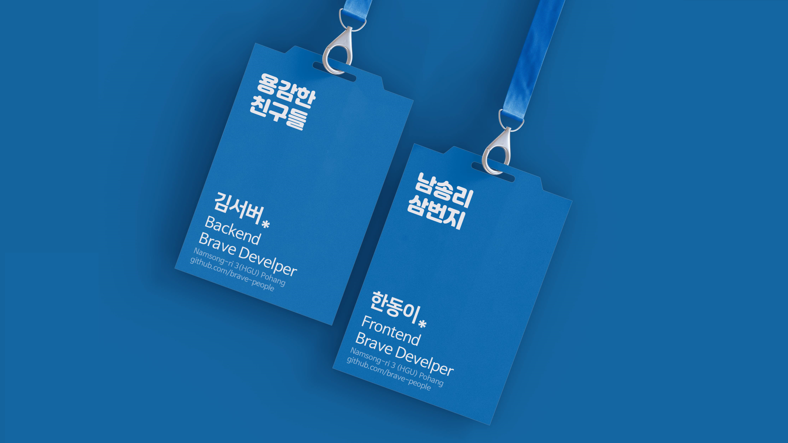
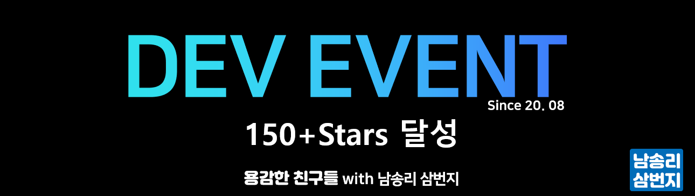

## 🎉 Dev Event 150+ 스타 달성

## " 용감한 친구들 " 용감이를 소개합니다. 

[github.com/brave-people/brave-member](https://github.com/brave-people/brave-member)

" 용감한 친구들 "(이하 용친)은 HGU 출신 개발자들의 모임입니다.  
현재 [데브 이벤트](https://github.com/brave-people/Dev-Event)를 관리중이며 데브이벤트 Client, Server를 개발중에 있습니다.

 

  
Dev Event 150+ 스타 달성

  ## 🎉 Dev Event 150+ 스타 달성

  

  

  [Dev Event](https://github.com/brave-people/Dev-Event)가 150스타를 달성했습니다.  
  방문, PR 그리고 스타 눌러주신 분들 감사합니다. 🙏

--------------

  

 

  
2020 컨트리뷰톤 가비아 후원상

  ## 2020 컨트리뷰톤 가비아 후원상

  

  

  NexClipper Open Source Edition으로 참가하여 가비아 후원상을 받았습니다.  
  멘토님들, 함께하신 분들 감사합니다!

  [Blog. 2020 컨트리뷰톤 교육 후기](https://covenant.tistory.com/199)

  ------------

  

 

  
드라마 바이블 웨일브라우저 확장앱 출시
  

## 📣 드라마 바이블 웨일 확장앱 출시

  

  <a href="https://store.whale.naver.com/detail/nifdgfjcbdoidcipoeolgfjafcjoljli"> 웨일 스토어 - 드라마바이블</a> 👈 바로가기!

--------

--------

<h3> 🏃   I'm Covenant!  </h3>

👨‍🎓 School Of Computer Science at Handong Global Univㅤ 
👨‍💻 Junior Server Developer  

<!--
📄 [Resume](https://koeonyack.github.io/resume/) 

-->

 

### 🧰 Languages and Tools

<code>

  
</code>

  

### :octocat: My Github Stats

<!--

  

**KoEonYack/koeonyack** is a ✨ _special_ ✨ repository because its `README.md` (this file) appears on your GitHub profile.

Here are some ideas to get you started:

- 🔭 I’m currently working on ...x
- 🌱 I’m currently learning ...
- 👯 I’m looking to collaborate on ...
- 🤔 I’m looking for help with ...
- 💬 Ask me about ...
- 📫 How to reach me: ...
- 😄 Pronouns: ...
- ⚡ Fun fact: ...
-->
